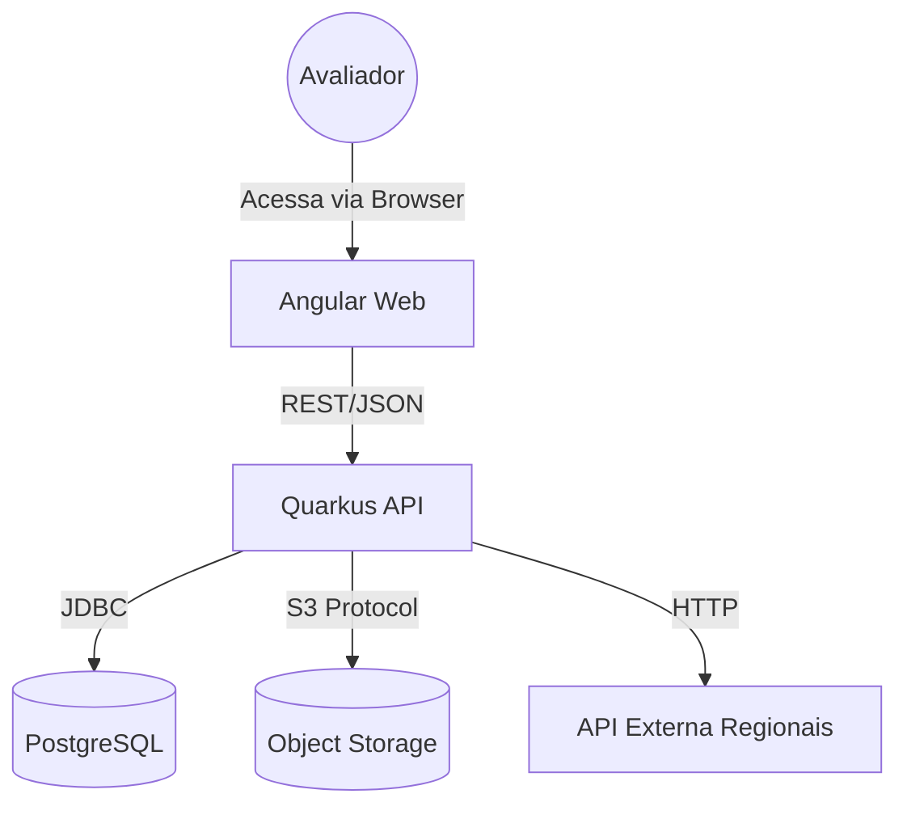

# Documentação Técnica e Arquitetural

Este documento consolida as decisões de engenharia, modelagem de dados e justificativas técnicas.

## 1. Stack Tecnológica (Justificativa)

| Componente | Tecnologia | Motivo da Escolha |
| :--- | :--- | :--- |
| **Backend** | **Quarkus (Java 17)** | Startup time milimétrico e baixo consumo de memória (Ideal para containers). Suporte nativo a containers via Jib. |
| **Frontend** | **Angular 16+** | Framework robusto, tipado (TypeScript) e estruturado, facilitando a manutenção e separação de responsabilidades. |
| **Banco** | **PostgreSQL 15** | Robusto, relacional e compatível com as regras de integridade exigidas. |
| **Storage** | **MinIO** | Simula API S3 AWS localmente. Garante que binários não pesem no Banco de Dados (Best Practice). |

## 2. Diagrama de Containers (C4 Model)

O sistema opera isolado em uma rede Docker interna (`maestro-net`).

## 3. Modelagem de Dados (MER Simplificado)

* **ARTISTA:** `id`, `nome` (Unique), `foto_url` (Aponta para o MinIO).
* **REGIONAL:** Tabela com suporte a versionamento temporal (SCD Tipo 2).
    * `id`: PK interna.
    * `external_id`: ID da API do governo.
    * `hash`: SHA-256 para comparação rápida.
    * `ativo`: Boolean (controle de versão).
    * `data_inicio` / `data_fim`: Validade do registro.
